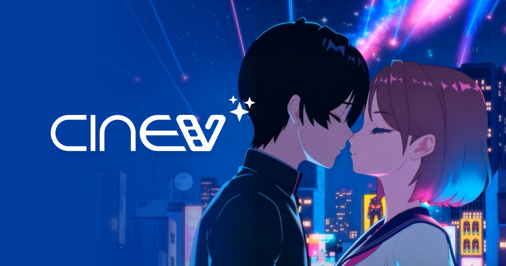

# CinevStudio

## 프로젝트 개요

| 항목 | 내용 |
|------|------|
| 기간 | 2022.11 — 2024.10, 2024.12 — 2026.03 (3년 5개월, 중간 2개월 이직 및 재입사) |
| 역할 | 클라이언트 개발 시니어 프로그래머 |
| 제품 | CINEV 서비스의 내부 3D 영상 콘텐츠 제작 소프트웨어 |
| 기술스택 | C++, Unreal Engine 4/5, LLM Function Calling, Git |
| 링크 | [CINEV 서비스](https://cinev.com/ko/), [유튜브 @studioCINEV](https://www.youtube.com/@studioCINEV), [Steam CINEV Studio](https://store.steampowered.com/app/2357940/CINEV_Studio/) |

<!-- 보존용 스크린샷: cinev-screenshot.png(랜딩페이지), cinev-youtube.png(유튜브 채널), cinev-og.png(OG 이미지) -->

---

## 프로젝트 배경

이 소프트웨어는 시나몬(Cinnamon)이 개발한 **CINEV** 서비스의 내부 응용 소프트웨어이다. CINEV는 AI 기반 3D 애니메이션 플랫폼으로, 사용자가 텍스트 프롬프트로 3D 영상 콘텐츠를 제작할 수 있는 서비스이다. 이 소프트웨어는 CINEV 서비스의 핵심 제작 엔진으로, Unreal Engine을 기반으로 카메라 연출, 시퀀스 편집, AI 모델 연동, 렌더링 파이프라인을 처리한다.

CINEV 서비스의 전체 흐름은 다음과 같다.

```
사용자 프롬프트
    → LLM: 장면 정의 생성 (Shot 구성, 캐릭터 위치, 카메라, 대사 등)
    → 3D Scene 생성 (Unreal Engine 기반)
    → 렌더링 (MovieRenderQueue)
    → Web 사용자에게 결과 전달
```

[](https://cinev.com/ko/)
<!-- 보존용 스크린샷: ../assets/images/cinev-screenshot.png (원본 링크 소실 시 대체) -->

캐릭터와 배경의 일관성 유지, 컨텍스트 유지, 재현성, 정밀한 편집, 카메라 및 연출 의도의 정확한 제어를 위해, LLM을 이용해 장면에 대한 구조화된 정의를 생성하고 이를 기반으로 3D Scene을 구성하는 방식이 채택되었다. 이 소프트웨어는 이 파이프라인 중 LLM 출력을 3D Scene으로 변환하고 렌더링하는 핵심 엔진 역할을 담당했다.

3D 영상 콘텐츠 제작은 일반적으로 전문가용 DCC 도구와 후반보정 파이프라인을 통해 이루어진다. 그러나 실시간 엔진 기반으로 제작 흐름을 단축하고, 비전문가도 사용할 수 있는 수준의 제작도구가 필요했다. CINEV는 Unreal Engine을 코어로 삼아, 영상 콘텐츠 제작에 필요한 촬영 구성, 편집, 렌더링, AI 기능을 하나의 도구로 통합하는 것을 목표로 했다.

개발 기간 중 Unreal Engine 4에서 5로의 메이저 엔진 업데이트가 있었고, 이로 인한 SequencePlayer 동작 방식 변경이 프로젝트 전반에 영향을 주었다.

2024년 10월 이직으로 인해 프로젝트에서 일시 이탈했다가, 2024년 12월 재입사하여 기존 프로젝트에 복귀했다. 2개월의 공백을 제외하면 전체 3년 5개월 동안 해당 제품 개발에 참여했다.

주요 제약은 다음과 같았다.

- Unreal Engine의 기능을 활용하되, 제품 고유의 워크플로우를 엔진 업데이트에 종속되지 않게 유지
- 실시간 편집과 최종 출력 품질 간의 균형
- AI 모델의 결과물을 중간 과정이 아닌 제작 파이프라인의 일부로 자연스럽게 통합

---

## 담당 범위

서비스 전체 아키텍처 결정은 팀 내 논의를 통해 이루어졌고, 시니어 개발자로서 의견 제시와 검토에 참여했다. 실제로 주도적으로 작업한 영역은 세부 기능 설계 및 구현이며, 특히 Camera Direction System은 전반적인 책임을 가지고 설계부터 검증까지 전담했다.

- 요구사항 분석
  - 제품에서 필요한 촬영 구성, 편집, AI 기능의 요구사항 도출 및 우선순위 조정
  - Unreal Engine 버전 변경에 따른 영향 분석 및 대응 방안 검토
  - Action System의 POC 기획 및 설계, 이후 팀에 이관

- 설계
  - Camera Direction System 구조 설계 (Shot 정의, AutoCamera, LLM 인터페이스)
  - Sequence 기반 콘텐츠 생성 및 편집 데이터 구조 설계
  - LLM 기능 REST API 설계 및 Data Schema 정의
  - 학습모델 연동 인터페이스 설계
  - Grouped Action System의 Plugin 구조 설계 및 POC 검증
  - CLI 기반 MovieRenderQueue 파이프라인 설계

- 구현
  - Camera Direction System 핵심 로직 구현
  - Sequence 편집 기능 개발
  - AI 연동 기능 구현 및 제작 파이프라인 통합
  - UE5 마이그레이션에 따른 MovieScene 갱신 방식 우회 구현
  - LLM 연동을 위한 동기 HTTP 통신 모듈 구현

- 검증
  - 기능 단위 테스트 및 제작 흐름 기반 통합 검증
  - Unreal Engine 버전 업데이트에 따른 회귀 검증
  - 실제 영상물 분석 기반 Camera System 동작 검증

- 운영
  - Git 기반 소스 관리 및 브랜치 전략 수립 참여
  - CI/CD 파이프라인 운영 및 유지보수

- 협업
  - 기획, 디자인, AI 엔지니어와의 기능별 협업
  - 코드 리뷰 및 개발 프로세스 개선 참여

---

## 주요 기능

### Camera Direction System

초기 Shot은 피사체 크기(1~9 양자화)와 피사체 기준 상대 Yaw/Pitch/FOV로 정의되어 Camera Transform으로 출력되었다. 연출/영상제작 직군의 대표적인 카메라 샷들로부터 파라미터를 역산하여 **Template Library**(DataTable, 30~300개 가변)로 구축하고 Tag(샷사이즈/방향/높이 3집합 조합)를 부여했다.

이후 **Black-eye Plugin** 도입으로 Shot Size 양자화는 제거되고 **DesiredViewSize**(1~100 float, 피사체 화면 점유율 %)로 대체되었다.

**2인 이상 샷(OTS) 대응.** 기준 피사체를 선정하여 방향/Orient 기준을 설정하고, 피사체 간 거리/방향에 따른 **Restriction Rule**을 추가했다.

**Obstacle 대응.** 피사체 안면부 ROI 기준 카메라 LineTrace로 가려짐을 판정했다.

**Off-screen Sequence Evaluation.** 카메라 계산이 Off-screen에서 이루어져야 했으므로, 요청 Tick에 Sequence를 갱신하고 Tick 기반 애니메이션을 안정화(Stable Pose Detector)하여 특정 프레임의 정확한 캐릭터 모션을 도출했다.

**Black-eye 연동.** Black-eye는 Tick base Damping 계산으로 자연스러운 카메라 이동을 제공했지만, Non-deterministic하여 MRQ의 Deterministic Sequence로 재현하기 어려웠다. PoC 단계에서 이 취약점을 보고했으나 강력한 요구로 플러그인 사용이 결정되어, Black-eye 카메라 타임라인 시퀀스를 Tick base 시뮬레이션 → Sampling → 일반 카메라 타임라인에 적용하는 방식으로 우회했다. Sampling 간격은 매 프레임에서 3프레임으로 조정하고 오차를 제시해 합의했으며, 간격은 파라미터화하여 추후 수정 가능하게 설계했다.

### Sequence 기반 콘텐츠 편집

콘텐츠 제작의 기본 단위를 Sequence로 정의하고, 복수의 Sequence를 조합하여 완성된 영상을 구성하는 구조.

- 기술 선택 이유: Unreal Engine Sequencer를 기반으로 하되, 제품의 데이터 모델과의 결합도를 낮추어 엔진 업데이트 영향을 최소화
- 구조: Sequence 단위의 독립적 데이터와 시각적 편집 UI를 분리

### LLM 및 AI 모델 연동

LLM과 학습 모델을 제작 파이프라인에 통합하여 텍스트 기반 콘텐츠 생성, 장면 구성 자동화, 스타일 전이 등을 지원.

- 기술 선택 이유: 생성형 AI의 결과물을 단순한 참고자료가 아닌 편집 가능한 제작 데이터로 변환하여 파이프라인에 통합
- 구조: AI 모델 호출 → 결과 파싱 → 제작 데이터 변환 → Sequence에 반영하는 단계적 인터페이스 구성
- LLM 기능 REST API를 통해 요청/응답 데이터 구조 정의, AI 엔지니어 및 기획팀과 협의하여 명세 확정
- LLM Function Calling을 활용하여 AI 모델의 출력을 구조화된 제작 명령어로 변환

### Grouped Action System

두 캐릭터 이상의 애니메이션을 간편하게 배치하기 위한 시스템. 쌍으로 촬영된 **Animation Pair** 데이터에서 시작 지점의 **Relative Transform**을 도출하여, 사용자가 UI에서 원하는 위치를 지정하면 두 캐릭터의 Transform을 계산하고 타임라인에 같은 시점에 애니메이션 시퀀스를 삽입했다.

POC 완료 후 팀에 이관했으며, 재입사 후 재담당했으나 회사 구조조정으로 실제 제품 적용까지는 도달하지 못했다.

### CLI 기반 렌더링 파이프라인

**2단계 Sequence 구조.** Actor 배치/애니메이션/편집을 위한 **SceneSequence**와, SceneSequence들의 카메라 컷을 자유롭게 배치하여 렌더링하기 위한 **RenderSequence**(UMovieSceneShotTrack)로 책임을 분리했다. MRQ는 RenderSequence를 소스로 사용하여 멀티 Scene을 넘나들며 렌더링했다. Camera Candidate Template 목록에 대한 렌더링도 포함했다.

---

## 설계 및 구현

### Camera Direction System

초기 Shot은 피사체 크기(1~9 양자화)와 피사체 기준 상대 Yaw/Pitch/FOV로 정의되었다. 연출/영상제작 직군의 대표적인 카메라 샷들로부터 파라미터를 역산하여 **Template Library**(DataTable)로 구축하고 Tag(샷사이즈/방향/높이 3집합 조합)를 부여했다.

**Black-eye Plugin 도입.** Shot Size 양자화는 **DesiredViewSize**(1~100 float %)로 대체되었다. Black-eye는 Non-deterministic한 Tick base Damping 계산으로 MRQ의 Deterministic Sequence 재현이 어려웠으나, Tick base 시뮬레이션 → Sampling → 일반 카메라 타임라인 적용 방식으로 우회했다. Sampling 간격은 매 프레임에서 3프레임으로 조정하고 오차를 제시해 합의했다.

**2인 이상 샷(OTS).** 기준 피사체 선정 + Restriction Rule. **Obstacle.** 안면부 ROI LineTrace. **Off-screen Evaluation.** Stable Pose Detector로 애니메이션 안정화.

### LLM Content Pipeline

3계층 구조로 분리: **Frontend(Web)** → 사용자 프롬프트 수신/LLM 요청, **Backend** → LLM 응답 정제/저장/CLI 실행, **Client(Unreal Engine CLI)** → JSON 기반 레벨 로드/Actor 생성배치/타임라인 구성.

JSON은 Asset, 배치 위치, 시점별 타임라인 구성을 **Tag/Alias**로 지정하고, 클라이언트는 **DataTable** Lookup으로 수행했다. Unreal Engine HTTP 모듈의 Async Callback을 스레드 대기 방식으로 동기 래핑하여 순차 처리했다.

### UE5 마이그레이션

UE5에서 `SetPlayPosition`이 더 이상 즉시 Scene 상태를 업데이트하지 않아, `EvaluateSynchronousBlocking`을 `SetHasJumped(true)` 컨텍스트로 호출하는 Interrogator를 구현했다. Skeletal Mesh Double Buffering 문제로 첫 평가는 두 번 수행했고, 평가 후 `EvaluateAllConstraints`로 IK 등의 Constraint를 적용했다. 주요 Socket(pelvis, hand_l/r, index_finger_l/r) 기준 Pose 변화를 감지하여 수렴할 때까지 반복 평가하는 **Stable Pose Detector**를 함께 구현했다.

### Grouped Action System

두 캐릭터 이상의 애니메이션을 간편하게 배치하기 위한 시스템. 쌍으로 촬영된 **Animation Pair** 데이터에서 시작 지점의 **Relative Transform**을 도출하여, 사용자가 UI에서 원하는 위치를 지정하면 두 캐릭터의 Transform을 계산하고 타임라인에 같은 시점에 시퀀스를 삽입했다.

### CLI 기반 렌더링 파이프라인

2단계 Sequence 구조(SceneSequence/RenderSequence)로 설계했다. MRQ Commandlet 환경에서 RenderSequence를 소스로 멀티 Scene 렌더링을 수행했으며, Camera Candidate Template 렌더링도 포함했다.

**Lumen Warm-up.** 조명 안정화를 위해 약 1초 분량의 Warm-up 프레임을 MRQ 파이프라인에 설정했다.

**Motion Blur.** 연속 Section 배치로 인한 카메라 컷 시작 지점의 Transform/FOV Jump가 원인이었다. 1차로 카메라 클립별 독립 트랙을 생성했으나 UObject 생성/소멸 급증으로 GC 비용이 감당 불가능해져, 최종적으로 카메라 클립 앞쪽을 **1프레임만 Stretch**하여 **지그재그로 배치**하는 Track Optimization으로 해결했다.

**오디오.** 오디오 렌더를 분리 Export한 후 FFMPEG로 클립별 Mux 처리했다.

---

## 개발 환경 및 운영

- 소스 관리: Git 기반 브랜치 전략 수립 (기능 브랜치 → develop → release)
- 빌드: Unreal Engine 빌드 시스템 기반 자동화 구성
- 자동화: CI/CD 파이프라인 구축 및 운영 (빌드 자동화, 패키징, 배포)
- 협업 방식: 코드 리뷰 정착, 이슈 트래킹 도구 활용
- 문서화: 기능별 설계 문서 및 API 사용 가이드 작성

---

## 결과

- Camera Direction System 구축 (Template Library, Black-eye 연동, OTS/Obstacle 대응)
- UE5 마이그레이션 대응 (EvaluateSynchronousBlocking 우회, Stable Pose Detector)
- CLI 기반 MRQ 렌더링 파이프라인 구축 (Scene/RenderSequence 분리, Motion Blur Track Optimization, Lumen Warm-up, Audio Mux)
- LLM 3계층 콘텐츠 생성 파이프라인 구축 (Frontend/Backend/Client CLI, DataTable Lookup)
- Grouped Action System POC (Animation Pair, Relative Transform)
- Git 브랜치 전략 및 CI/CD 파이프라인 운영 체계 구축

---

## 회고

UE4에서 UE5로의 전환은 단순한 버전 업이 아니라 SequencePlayer의 동작 방식 자체가 바뀌는 근본적인 변화였고, `EvaluateSynchronousBlocking` 우회 구현이 프로젝트 일정에 큰 영향을 주었다.

AI 기능 통합은 모델 출력 품질보다 "출력을 어떻게 제작 파이프라인에 통합할 것인가"에 중점을 두었고, 이 접근은 결과물을 편집 가능하게 만들어 AI 생성 결과의 불완전성을 보완하는 구조가 되었다.

Grouped Action System은 POC까지 완료하고 이관했으나, 회사 구조조정으로 실제 제품 적용까지는 도달하지 못했다. 기술적 타당성과 제품화 단계의 리스크는 별도로 관리되어야 한다는 점을 체감했다.
