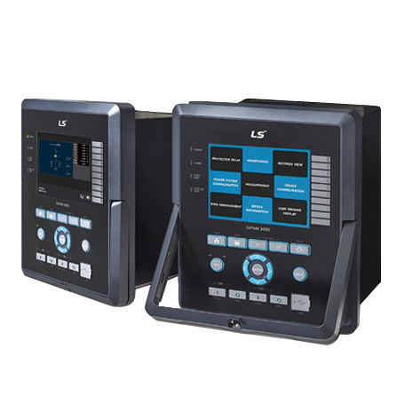

# GIPAM3000 전면 HMI

## 프로젝트 개요

| 항목 | 내용 |
|------|------|
| 기간 | 2017.01 — 2020.03 (3년 3개월) |
| 역할 | 개발팀장 과장 |
| 제품 | LS Electric GIPAM3000 디지털 전력보호 감시장치 전면 HMI |
| 기술스택 | C++, Qt, Embedded Linux, MODBUS-TCP, SVN |

---

## 프로젝트 배경

LS Electric GIPAM3000은 수/배전 설비의 고장 감시와 보호를 수행하는 디지털 전력보호 감시장치(Digital Protection Relay)이다. 과전류, 과전압, 지락전류 등 34종의 보호 요소를 지원하며, MODBUS, DNP3.0, IEC61850 등 다양한 통신 프로토콜을 제공한다.

이 장치의 전면 HMI는 사용자가 보호계전기의 상태를 확인하고 설정을 변경하며, 사고 이력을 조회할 수 있는 인터페이스이다. 본 프로젝트는 하이버스가 LS Electric의 외주 개발사로서 GIPAM3000에 탑재될 전면 HMI Application을 개발한 것이다.

[](https://www.ls-electric.com/ko/product/view/P01249)
<!-- 보존용 스크린샷: ../assets/images/xgipam-web.png -->

주요 제약은 다음과 같았다.

- Windows(개발 환경)와 Embedded Linux(타겟) 교차환경에서 동일한 코드베이스로 동작
- 보호계전기의 신뢰성 요구사항 (장시간 연속 운영, 실시간 응답)
- 전력 설비의 다양한 보호/계측 데이터를 제한된 전면 패널 UI로 표현
- 제품 모델별(FI형, T형)로 다른 보호 요소와 설정 항목을 UI에서 유연하게 대응

---

## 담당 범위

- 요구사항 분석
  - LS Electric 측으로부터 GIPAM3000 전면 HMI 기능 요구사항 수집
  - 보호/계측 데이터의 UI 표시 항목 및 사용자 조작 흐름 정의
  - Embedded Linux 타겟 환경에서의 메모리 및 성능 제약 분석

- 설계
  - Qt 기반 전면 HMI Application 전체 구조 설계
  - DOT Matrix LED 및 버튼 인터페이스 제어 구조 설계
  - MODBUS-TCP 통신 인터페이스 구조 설계
  - 보호 요소별 설정 메뉴의 데이터 모델 및 UI 구조 설계

- 구현
  - Qt 기반 전면 HMI Application 핵심 기능 구현
  - 보호계전기 상태 표시 및 계측값 표시 UI 개발
  - 설정 메뉴 및 보호 요소 파라미터 편집 기능 개발
  - MODBUS-TCP 통신 모듈 구현

- 검증
  - 교차 플랫폼 환경에서의 동작 일관성 검증
  - 장시간 연속 동작 안정성 테스트
  - 보호 요소별 설정 값 및 동작 표시 정합성 검증
  - 메모리 누수 및 소프트웨어 결함 확인을 위한 장시간 테스트 계획 및 수행
  - 고객사 QA 부서와 협력하여 실제 환경 조건을 반영한 테스트베드 운영 (온도, 습도, Surge 등 물리적 환경 테스트 병행)

- 운영
  - LS Electric 측 요구사항 대응 및 기능 개선
  - 제품 릴리즈 및 유지보수 지원

- 협업
  - LS Electric 측 기술팀과의 기능 정의 및 인터페이스 협의
  - 고객사 SW 전담 조직과 코드 리뷰 및 개선 작업 협업
  - 하드웨어 팀과 전면 패널 버튼/디스플레이 연동 협업

---

## 주요 기능

### 보호계전기 상태 및 계측값 표시

GIPAM3000이 측정한 전압, 전류, 전력, 주파수 등의 계측값과 보호 요소의 동작 상태를 전면 HMI에 표시.

- 기술 선택 이유: 제한된 DOT Matrix LED 영역에 다량의 계측 정보를 효과적으로 표시하기 위해 페이지 기반 화면 전환 구조 채택
- 구조: 계측 데이터 수집 계층과 UI 표시 계층을 분리하여, 데이터 소스(내부 레지스터, MODBUS) 변경에 유연하게 대응

### 보호 요소 설정 및 편집

GIPAM3000이 지원하는 34종의 보호 요소(OCR, OVGR, UFR 등)에 대한 설정값 조회 및 편집 기능.

- 구조: 보호 요소별 파라미터를 트리 형태의 메뉴로 구성하고, 전면 버튼을 통한 탐색 및 값 편집 기능 구현
- 표시: 각 보호 요소의 현재 설정값, 동작 상태(정상/경고/트립), 이력을 전면 HMI에서 확인 가능

### MODBUS-TCP 통신

GIPAM3000 보호계전기의 내부 데이터를 외부 시스템(SCADA, 상위 HMI)과 교환하기 위한 통신 기능.

- 기술 선택 이유: LS Electric 설비와의 호환성을 위해 MODBUS-TCP가 필수적이었으며, TCP/IP 기반이므로 Embedded Linux 환경에서도 일관된 구현 가능
- 구조: 통신 세션 관리, 요청/응답 타임아웃 처리, 재연결 로직을 포함한 통신 모듈을 별도 계층으로 분리

---

## 설계 및 구현

### 전면 HMI의 데이터 모델과 UI 분리

GIPAM3000은 34종의 보호 요소와 수많은 계측 항목을 가진다. 이 데이터를 전면 HMI에 표시하고 편집 가능하게 하려면, 보호 요소별 데이터 모델을 UI 표현으로부터 분리하는 구조가 필요했다.

각 보호 요소(OCR, OVGR, UFR 등)의 파라미터를 구조화된 데이터 모델로 정의하고, UI는 이 모델을 탐색하고 편집하는 일반화된 뷰어 역할을 하도록 설계했다. 새로운 보호 요소가 추가되면 데이터 모델 정의만 추가하면 되고, UI 코드는 변경할 필요가 없다.

### 스크립트 기반 동적 UI 구성

GIPAM3000은 MODBUS 프로토콜을 통해 접근하는 방대한 양의 보호 요소 파라미터와 계측 데이터를 가진다. 각 데이터는 고유한 MODBUS 주소와 데이터 타입을 가지며, 이 정의는 스프레드시트로 관리되었다. 사실상 스프레드시트가 곧 제품의 세부 동작 사양서 역할을 했다.

이 데이터를 UI 페이지로 일일이 하드코딩하는 것은 보호 요소 수와 파라미터 양을 고려할 때 실용적이지 않았다. 다음과 같은 접근으로 해결했다.

- 스프레드시트를 CSV로 export한 후, UI 구성에 필요한 메타데이터(메뉴 계층, 표시 이름, 값 범위, MODBUS 주소 맵핑)를 추가하여 UI 리소스 파일로 변환
- Application 구동 시 CSV 리소스를 파싱하여 메뉴 계층을 동적으로 구성하고, 각 항목에 대응되는 MODBUS 통신 인터페이스를 자동으로 연결
- 새로운 보호 요소나 파라미터가 추가되면 스프레드시트만 갱신하고 CSV를 재생성하면 UI가 자동으로 반영

전체 메뉴 계층은 다음과 같이 구성되었다.

```
[첫 페이지]
├── 보호계전 메뉴 — CSV 파싱을 통한 동적 메뉴 구성
│   ├── 보호계전 목록 페이지
│   │   └── 그룹설정 페이지
│   │       └── 파라미터 목록
├── 상태감시
├── 기록열람
├── 계통설정
├── 계측
├── 기기설정
├── 데이터관리
└── 기기정보
```

보호계전 메뉴를 제외한 나머지 메뉴(상태감시, 기록열람, 계통설정 등)는 고정된 UI 구조를 가지므로 별도로 구현했다. 보호계전 메뉴만이 유일하게 동적 구성 대상이었는데, 이는 보호 요소의 종류와 파라미터가 제품 모델(FI형/T형)과 고객사 요구에 따라 변경되었기 때문이다.

### 제한된 전면 패널에서의 정보 표현

GIPAM3000의 전면 HMI는 DOT Matrix LED와 제한된 수의 버튼으로 구성된다. 터치스크린이 아닌 물리적 버튼 환경에서 복잡한 보호 설정 메뉴를 탐색 가능하게 만드는 것이 과제였다.

메뉴를 계층 구조로 설계하고, 버튼 입력(이동, 선택, 뒤로가기, 숫자 입력)을 일관된 동작으로 매핑했다. 각 메뉴 항목에 단축 번호를 할당하여 숙련된 사용자가 빠르게 원하는 설정에 접근할 수 있도록 했다.

### Embedded Linux 환경 최적화

Embedded Linux 타겟 환경에서는 제한된 리소스(메모리, CPU, 저장 공간) 내에서 Application이 안정적으로 동작해야 했다.

- 부팅 시간 단축을 위한 Application 초기화 지연 로딩
- Read-only filesystem에서의 설정 데이터 저장 위치 및 관리 방식 설계

**프레임버퍼 렌더링 성능 문제.** DOT Matrix LED 환경에서 화면 전환 시 Tearing(찢김) 현상과 상위 메뉴가 잠시 잔상으로 보이는 문제가 발생했다. 이를 해결하기 위해 화면 전환 처리 순서를 조정했다 — 이전 화면을 완전히 지운 후 새 화면을 렌더링하도록 순서를 강제하고, 렌더링이 완료될 때까지 입력을 차단하여 중간 상태가 노출되지 않도록 했다.

그러나 이 방식은 새로운 문제를 만들었다. 버튼 입력의 채터링(chattering)으로 인해 의도치 않은 메뉴 이동이 발생했고, 보이지 않는 모달 창이 입력을 차단하여 사용자 조작이 먹통이 되는 현상이 나타났다. 이러한 문제는 입력 신호의 디바운스(debounce) 처리와 모달 상태와 화면 전환 상태를 분리하여 관리하는 방식으로 해결했다.

**Watchdog 기반 장애 복구.** Embedded Linux 시스템의 불안정성으로 인해 Application이 응답 불능 상태에 빠질 가능성이 있었다. Application이 주기적으로 Watchdog 타이머에 pulse 신호를 전송하고, OS 레벨에서 이 pulse가 일정 시간 감지되지 않으면 시스템을 강제 재부팅하는 로직을 구현했다. 이는 Application이 스스로 자신의 건강 상태를 증명하고, 문제 발생 시 사람의 개입 없이 복구될 수 있도록 한 구조였다.

### 소프트웨어 신뢰성 확보

전력 보호계전기는 장시간(수개월~수년) 연속 운영되어야 하므로, 메모리 누수나 소프트웨어 결함으로 인한 동작 불능이 발생해서는 안 된다. 이 문제는 설계 단계부터 검증 단계까지 일관되게 고려해야 했다.

**정적 분석을 통한 결함 조기 발견.** Source Insight를 이용한 정적 분석을 정기적으로 수행하여 메모리 누수, 널 포인터 역참조, 리소스 해제 누락 등의 잠재적 결함을 코드 작성 단계에서 조기에 발견하고 수정했다. 정적 분석 결과는 고객사 SW 전담 조직과 공유하여 리뷰 및 개선 작업을 진행했다.

**메모리 관리 방식.** 동적 할당 사용을 최소화하고, 필요한 경우에도 할당과 해제 시점을 명확히 정의하여 사용했다. 정적 분석 결과에서 지적된 메모리 관련 이슈는 반드시 해결 대상으로 분류하고, 해결 여부를 추적했다.

**실제 환경 기반의 장시간 테스트.** 단위 기능 검증 외에도, 메모리 누수 및 소프트웨어 결함 확인을 목적으로 한 장시간 연속 동작 테스트를 계획하고 수행했다. 고객사 QA 부서와 협력하여 실제 운영 환경을 반영한 테스트베드를 구축하였고, 여기에는 온도, 습도, Surge 등의 물리적 환경 조건을 포함한 테스트가 함께 진행되었다. 단순한 조작 및 동작 알고리즘 검증을 넘어, 실제 설치 환경과 유사한 조건에서의 안정성을 확인하는 것이 목적이었다.

### MODBUS 프로토콜 구현

GIPAM3000과 외부 시스템(SCADA, 상위 HMI) 간의 통신은 MODBUS-TCP 프로토콜을 통해 이루어진다. 이 프로젝트에서는 MODBUS 프로토콜 사양을 외부 라이브러리에 의존하지 않고 C++ 코드로 직접 구현했다.

초기 개발 단계에서는 실제 통신이 가능한 MODBUS 장비가 없었다. 이 문제를 해결하기 위해 다음과 같은 단계로 검증을 진행했다.

1. **시뮬레이션 서버 개발.** MODBUS-TCP 질의/응답을 처리하는 시뮬레이션 서버를 TCP/IP 소켓 기반으로 별도로 구현하여, HMI Application이 전송한 MODBUS 요청에 대해 가상의 응답을 반환하도록 했다. 이를 통해 실제 장비 없이도 프로토콜 동작의 기본 흐름과 예외 처리를 검증할 수 있었다.

2. **기존 MODBUS 장비를 통한 검증.** 시뮬레이션 검증을 통과한 후, 시중에 있는 다른 MODBUS 지원 장비를 연결하여 실제 통신 상황에서의 구현 정합성을 확인했다. 이 과정에서 Byte order 바이트 정렬, CRC checksum 계산 같은 프로토콜 세부 사항을 검증했다.

3. **고객사 장비를 통한 최종 검증.** LS Electric의 실제 GIPAM3000 장비 동작이 가능해졌을 때 최종 통신 검증을 수행했다. 여기서는 프로토콜 자체보다는 실제 보호 요소 데이터의 주소 맵핑, 데이터 타입 일치성, 통신 타임아웃과 재연결 동작을 중점적으로 검증했다.

이러한 접근은 하드웨어 개발 일정과 소프트웨어 개발 일정이 분리되어 있을 때 소프트웨어 개발이 하드웨어에 블로킹되지 않도록 하는 데 효과적이었다.

### 교차 플랫폼 대응

Windows(개발 환경)와 Embedded Linux(타겟) 간의 플랫폼 차이는 추상화 계층으로 분리했다. Qt가 제공하는 플랫폼 추상화만으로는 하드웨어 특화 기능(GPIO, Watchdog, LED 제어)을 커버할 수 없었다.

문제가 된 부분은 장치 접근 경로 차이(/dev/ 경로, sysfs 인터페이스), OS 종속적인 외부 유틸리티 호출 등이었다. Qt가 추상화하지 못하는 이 영역을 처리하기 위해 다중 플랫폼을 지원하는 오픈소스 라이브러리들과 유사한 방식으로 전처리기(`#ifdef`, `#if defined`) 기반 조건부 컴파일을 사용했다.

```
#ifdef TARGET_LINUX
    // Embedded Linux 장치 접근 코드
    int fd = open("/dev/gpio_led", O_RDWR);
#elif defined(TARGET_WIN32)
    // Windows 시뮬레이션 코드
    simulate_gpio_led();
#endif
```

이 방식은 기능적으로는 동작했으나, 전처리기 분기가 코드 전체에 퍼지면서 가독성이 저하되고 유지보수를 어렵게 만드는 문제가 있었다. 이상적인 해결책은 HAL이 모든 플랫폼 차이를 깔끔하게 추상화하는 것이지만, 프로젝트 일정과 리소스 제약 내에서 실용적인 절충안으로 전처리기 기반 분기를 선택해야 했다.

---

## 개발 환경 및 운영

- 소스 관리: 회사 사내 SVN을 통해 형상 관리 (당시 Git은 도입되지 않음)
- 빌드: CMake 기반 교차 플랫폼 빌드 환경 (Cross-compile for ARM Embedded Linux)
- 자동화: 빌드 자동화 스크립트를 통한 Windows 개발 환경과 Embedded Linux 타겟 빌드 통합 (CI/CD는 도입되지 않음)
- 정적 분석: Source Insight를 이용한 정적 분석 정기 수행, 결과를 고객사 SW 조직과 공유 및 리뷰
- 코드 제공: 프로젝트 진행에 따라 고객사(LS Electric)에 코드, BSP, 툴체인 등을 점진적으로 외부 공개
- 협업 방식: LS Electric 측과 정기적인 기술 검토 및 기능 협의, SW 전담 조직과 코드 리뷰 진행
- 문서화: HMI 사용자 매뉴얼, 통신 프로토콜 정의서, 설정 메뉴 구조도

---

## 결과

- GIPAM3000 전면 HMI Application 안정화 및 제품 출시
- 전력보호계전기 전면 패널에서 보호 요소 설정/계측값 표시/사고 이력 조회 기능 구현
- MODBUS-TCP 기반 외부 시스템 연동 기능 확보
- 데이터 모델과 UI 분리 구조를 통한 보호 요소 추가 및 변경 대응
- 교차 플랫폼 추상화 계층 및 HAL을 통한 유지보수성 확보
- 제한된 DOT Matrix LED 환경에서의 정보 표현 구조 설계

---

## 회고

전력 보호계전기라는 도메인 특성상, HMI는 단순한 정보 표시를 넘어 사용자가 장비의 동작을 신뢰할 수 있도록 해야 했다. 설정 값을 변경했을 때 즉시 피드백이 표시되어야 하고, 보호 요소의 동작 상태가 직관적으로 전달되어야 했다.

외주 개발사의 입장에서 LS Electric과의 인터페이스 정의가 프로젝트의 중요한 부분이었다. 제품의 보호 요소 명세와 HMI에 표시할 데이터 항목을 정확히 정의하고, 변경 사항을 추적하는 체계가 필요했다.

제한된 DOT Matrix LED와 버튼 인터페이스에서 복잡한 설정 메뉴를 표현하는 것은 UI 설계의 주요 과제였다. 많은 정보를 작은 화면에 넣으려는 욕심을 버리고, 페이지 기반으로 정보를 분할하여 사용자가 원하는 정보를 단계적으로 찾아가는 구조를 선택한 것이 적절한 결정이었다.

