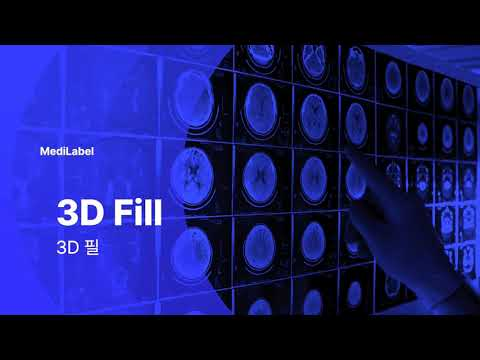

# MediLabel On-premise

## 프로젝트 개요

| 항목 | 내용 |
|------|------|
| 기간 | 2020.04 — 2022.11 (2년 8개월, 개발 중단으로 프로젝트 종료) |
| 역할 | 온프레미스 제품 개발 시니어 프로그래머 |
| 제품 | Qt 기반 의료영상 Labeling 및 Annotation 도구 |
| 기술스택 | C++, Qt, VTK, TensorFlow, REST API, Git |

---

## 제품 소개

MediLabel은 **인그래디언트(Ingradient, 구 재이랩스)** 에서 개발한 **딥러닝 기반 의료영상 라벨링 소프트웨어**다. 의료 AI 모델 학습에 필요한 대용량 의료 데이터(CT, MRI 등)에서 장기나 병변 영역을 반자동으로Annotation(라벨링)하는 도구이다.

이 제품이 기존 라벨링 도구와 다른 점은 다음과 같다.

- **세그멘테이션(segmentation) 특화**: 장기 및 병변 영역의 경계를 정밀하게라벨링할 수 있는 2D/3D 세그멘테이션 도구 제공
- **AI 기반 반자동 라벨링**: Smart Pen, Auto-contour, Smart Fill 등 AI가 라벨링을 보조하는 도구를 통해 라벨링 시간 단축
- **사용자 패턴 학습**: 쓸수록 사용자의 라벨링 패턴을 학습하여 예측 정확도 향상
- **프로젝트 관리 및 협업**: 대용량 데이터를 프로젝트 단위로 관리하고, 관리자-라벨러 역할 분리 및 검수 워크플로우 지원

주요 대학병원 의료진이 사용 중이며, 전과제 표준 의료기기 사업에 선정되었다.

---

## 프로젝트 배경

의료영상 Labeling 도구는 AI 학습 데이터 구축 과정에서 핵심적인 역할을 한다. 의사 또는 라벨러가 의료영상(CT, MRI 등)에서 장기나 병변 영역을 수동으로라벨링하고, 이 데이터가 AI 모델 학습에 사용된다.

기존 제품은 Web 기반으로 제공되고 있었으나, 대용량 의료영상 데이터를 처리하고 실시간 3D 시각화가 필요한 온프레미스 환경에서의 제품 요구가 있었다. 온프레미스 제품은 클라우드 의존성 없이 병원이나 연구소 내부망에서 운영되어야 했다.

주요 제약은 다음과 같았다.

- DICOM 형식의 대용량 의료영상을 Web 환경 수준의 반응성으로 처리
- 3D Volume 데이터의 실시간 시각화 및 편집
- TensorFlow 기반 AI 분할 결과를 편집 가능한 Label 데이터로 변환
- Cloud 서비스(REST API)와의 선택적 연동 구조 유지

---

## 담당 범위

- 요구사항 분석
  - 의료영상 Annotation 기능의 사용자 요구사항 분석 (라벨러, 의사, 연구자)
  - 대용량 데이터 처리 성능 요구사항 정의
  - 온프레미스 환경에서의 설치 및 운영 요구사항 정의

- 설계
  - Annotation 데이터 모델 구조 설계
  - VTK 기반 3D Viewer 및 Polygon/Volume 데이터 시각화 구조 설계
  - AI 모델 결과 통합을 위한 데이터 변환 인터페이스 설계

- 구현
  - Qt 기반 Annotation UI 및 상호작용 로직 구현
  - VTK 기반 3D 데이터 시각화 Viewer 개발
  - Isocontour, Sculpting 등 3D Label 편집 기능 구현
  - TensorFlow AI 모델 출력을 Label 데이터로 변환하여 통합
  - REST API 기반 Cloud 서비스 연동 구현

- 검증
  - 의료영상 데이터 포맷별(DICOM, NIfTI) 호환성 검증
  - 대용량 데이터 처리 성능 검증
  - 기능 단위 및 통합 테스트

- 운영
  - 제품 기능 개선 및 버그 수정을 통한 유지보수
  - 온프레미스 환경 대응 및 설치 패키징

- 협업
  - 기획 및 품질 담당자와 기능 정의 및 검증 협업
  - Cloud 서비스 개발팀과 REST API 연동 협업

---

## 주요 기능

### 의료영상 Annotation

의료영상에서 장기나 병변 영역을 Polygon 또는 Volume 형태로 Labeling하는 핵심 기능.

- 기술 선택 이유: Qt의 Graphics View Framework를 기반으로 2D Annotation 상호작용을 구현하고, 3D 데이터는 VTK 라이브러리를 활용
- 구조: 2D 슬라이스 기반 Annotation을 기본으로 하고, 이를 3D Volume 데이터로 재구성하여 일관된 데이터 모델 유지

### VTK 기반 3D Viewer

CT/MRI Volume 데이터를 3D 공간에서 시각화하고 회전/확대/축소가 가능한 Viewer.

- 기술 선택 이유: VTK는 의료영상 시각화 분야에서 표준적으로 사용되는 라이브러리로, Volume Rendering, Polygon 조작 등 필요한 기능을 제공
- 구조: VTK Render Window를 Qt Widget에 임베드하여 통합

### 3D Label 편집 (Isocontour, Sculpting)

Volume 데이터에서 특정 영역을 3차원 공간에서 직접 편집하는 기능.

- Isocontour: 특정 CT value 기준으로 등고선 형태의 영역을 자동 추출하여 Label로 변환
- Sculpting: 3D 공간에서 브러시 기반으로 영역을 추가/제거하는 편집
- 기술 선택 이유: 의료영상에서 장기 경계는 CT value에 따라 윤곽이 드러나는 경우가 많아, Isocontour는 효율적인 초기 Label 생성 방법

### TensorFlow AI 모델 통합

AI 분할 모델의 출력 결과를 제품 내 Label 데이터로 변환하고 편집 가능한 형태로 제공.

- 기술 선택 이유: TensorFlow 모델 출력(세그멘테이션 마스크)을 Polygon 또는 Volume Label 데이터로 변환하는 변환 레이어를 구현하여, 모델 종류에 독립적인 통합 구조 구성
- 구조: 모델 출력 파싱 → Label 데이터 변환 → Annotation UI에 표시 → 사용자 편집 가능

### REST API 기반 Cloud 연동

온프레미스 제품에서 Cloud 서비스로 데이터를 전송하거나 Cloud의 AI 분석 결과를 수신하는 기능.

- 기술 선택 이유: HTTP REST API를 인터페이스로 정의하여, Cloud 서비스와 온프레미스 제품 간 결합도를 낮춤
- 구조: API 클라이언트를 추상화하여 서비스 엔드포인트 변경에 대응 가능

---

## 설계 및 구현

### 2D-3D Annotation 데이터 일관성 유지

Annotation은 2D 슬라이스에서 수행되지만, 실제 대상은 3D Volume 데이터다. 2D Polygon으로 그린 영역을 3D 공간상의 연속적인 Volume 데이터로 변환하는 구조가 필요했다.

각 슬라이스의 Polygon을 3D 공간상의 Contour로 변환하고, 보간을 통해 슬라이스 사이의 영역을 채우는 방식으로 Volume Label을 생성했다. 역방향으로 Volume Label을 특정 슬라이스에서 2D Polygon으로 잘라내는 것도 가능하게 하여, 두 표현 간의 변환이 자유롭도록 했다.

고려했던 대안은 3D 공간에서 직접 Polygon을 그리는 방식이었으나, 의사와 라벨러에게 익숙한 2D 슬라이스 기반 조작 방식을 유지하는 것이 더 나은 사용자 경험을 제공한다고 판단했다.

### AI 모델 통합의 데이터 변환 레이어

TensorFlow 모델에서 출력된 세그멘테이션 마스크는 픽셀 단위의 Label Map이다. 이를 제품의 Polygon/Volume Label 데이터로 변환하는 과정에서 다음 문제를 해결해야 했다.

- 모델 출력의 잡음(noise) 제거 (작은 영역 필터링)
- Label 경계 스무딩
- 여러 장기의 Label이 겹치는 경우 우선순위 처리

변환 레이어를 별도 모듈로 분리하여, 추후 다른 AI 모델(PyTorch, ONNX 등)로 교체되더라도 제품 코어에 영향을 주지 않도록 했다.

---

## 개발 환경 및 운영

- 소스 관리: Git 기반 형상 관리
- 빌드: CMake 기반 빌드 시스템 (Qt, VTK 종속성 관리)
- 자동화: CI/CD 파이프라인을 통한 빌드 및 배포 자동화
- 협업 방식: 이슈 트래킹 및 코드 리뷰를 통한 협업
- 문서화: API 연동 규격서 및 기능 정의서 관리

---

## 결과

- 의료영상 Annotation 온프레미스 제품의 핵심 기능 안정화
- 2D/3D 간 일관된 Label 데이터 모델 설계 및 구현
- VTK 기반 3D 시각화 및 편집 기능 확보 (Isocontour, Sculpting)
- TensorFlow AI 모델 결과의 제품 통합 및 데이터 변환 레이어 구성
- REST API 기반 Cloud 연동을 통한 온프레미스-Cloud 하이브리드 구조 확보
- 기능 확장성을 고려한 AI 모델 독립적 통합 구조 적용

**2022년 제품 개발이 중단되어 프로젝트는 종료되었다.** 온프레미스 제품의 핵심 기능은 안정화 단계까지 완료되었으나, 회사의 사업 방향 전환으로 인해후속 개발이 진행되지 않았다.

---

## 회고

의료영상 도메인에서 가장 중요하게 고려해야 할 점은 데이터의 정확성과 사용자 조작의 신뢰성이었다. AI가 생성한 Label이라도 반드시 사람이 검증하고 수정할 수 있어야 했고, 이 요구사항이 전반적인 설계에 반영되었다.

VTK와 Qt의 통합은 잘 동작했지만, 두 라이브러리 간의 이벤트 전달과 메모리 관리에서 몇 가지 문제를 경험했다. 특히 대용량 Volume 데이터를 로드할 때의 메모리 사용량을 예측하고 제한하는 것이 필요했다.

다시 만든다면, AI 모델 통합 부분을 플러그인 구조로 설계하여 모델 추가와 교체를 더 유연하게 했을 것이다. 현재는 변환 레이어로 분리되어 있지만, 모델별로 다른 전처리/후처리 로직이 늘어나면서 구조가 점점 복잡해졌다.
