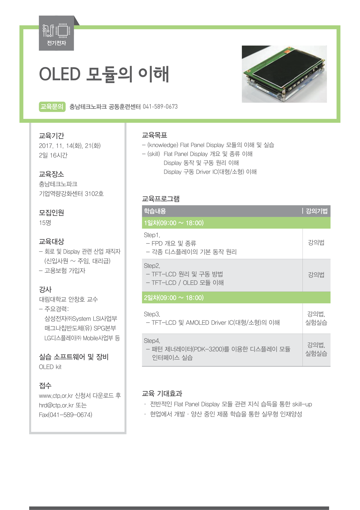

# PDK3200 (Hybus)

## 프로젝트 개요

| 항목 | 내용 |
|------|------|
| 기간 | 2011.08 — 2012.06 (10개월) |
| 역할 | Application 개발 |
| 회사 | Hybus (하이버스) |
| 제품 | OLED/LCD Tester & Demo Kit 제어 소프트웨어 |
| 기술스택 | 임베디드 SW, Windows Application, C/C++ |

---

> Hybus 재직 시절 참여한 프로젝트로, OLED/LCD 디스플레이 테스트 및 데모를 위한 장비(PDK3200 Tester&Demo Kit)의 제어 소프트웨어를 개발했다. 임베디드 소프트웨어와 PC용 Windows Application을 함께 작업했다.

## 프로젝트 배경

PDK3200은 OLED/LCD 패널의 테스트와 데모를 위한 장비로, 1080P(1920x1080) / SXGA(1280x1024) 해상도, 24bit True Color, MPI/RGB 인터페이스를 지원하는 디스플레이 테스트 키트다. 장비 내부의 임베디드 시스템에서 패널 구동 타이밍과 신호 생성을 실시간으로 처리하고, Windows 기반 PC Application에서 테스트 시나리오 관리와 사용자 인터페이스를 담당하는 이중 구조였다. 2017년에는 이 키트를 활용한 OLED 모듈 교육 과정(충남테크노파크)에도 사용되었다.

---

## 담당 범위

- 임베디드 소프트웨어 및 Windows Application 동시 개발
- OLED/LCD 패널 초기화 및 제어 기능 (임베디드 + Application)
- Pattern Generator(화면 테스트 패턴 출력) 기능 구현
- 장비 제어 및 상태 모니터링 사용자 인터페이스 개발
- 장비 운용을 위한 서비스 프로세스 및 응용 기능 개발

---

## 주요 기술 사항

### 임베디드 + PC Application 병행 개발

동일한 프로젝트 내에서 장비의 실시간 제어를 담당하는 **임베디드 소프트웨어**와, 전체 공정 관리 및 사용자 인터페이스를 담당하는 **Windows Application**을 함께 개발했다. 임베디드 측에서는 장비의 시퀀스 제어와 센서/구동부 직접 제어를, PC 측에서는 공정 모니터링과 데이터 로깅을 처리하는 역할 분담 구조였다.

### OLED/LCD 패널 제어 및 Pattern Generator

OLED 및 LCD 패널의 초기화 시퀀스를 제어하고, 패널 검증을 위한 테스트 패턴(Pattern Generator)을 출력하는 기능을 구현했다. Pattern Generator는 이미지 파일을 렌더링하는 방식이 아니라, **픽셀에 직접 dot를 출력**하는 방식으로 구현되었다. 다양한 해상도의 LCD 패널이 대상이었기 때문에, 패널별로 정확한 픽셀 단위 출력이 보장되어야 했다. 임베디드 레벨에서 패널 구동 타이밍과 MPI/RGB 인터페이스 신호 생성을 제어하고, Application 레벨에서 패턴 종류와 검사 시퀀스를 관리했다.

### 사용자 인터페이스 및 모니터링

작업자가 장비의 운용 상태를 실시간으로 확인할 수 있는 UI를 개발했다. 공정 진행 상황, 장비 상태, 에러 정보 등을 화면에 표시하고, 필요한 경우 수동 조작이 가능한 인터페이스를 제공했다.

---

## 개발 환경

- **언어**: C/C++
- **플랫폼**: 임베디드 + Windows
- **대상**: OLED/LCD Tester & Demo Kit
